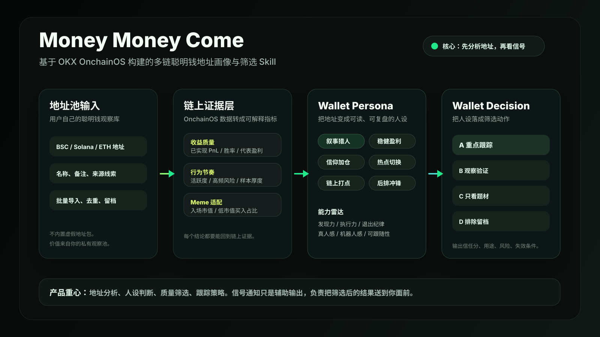
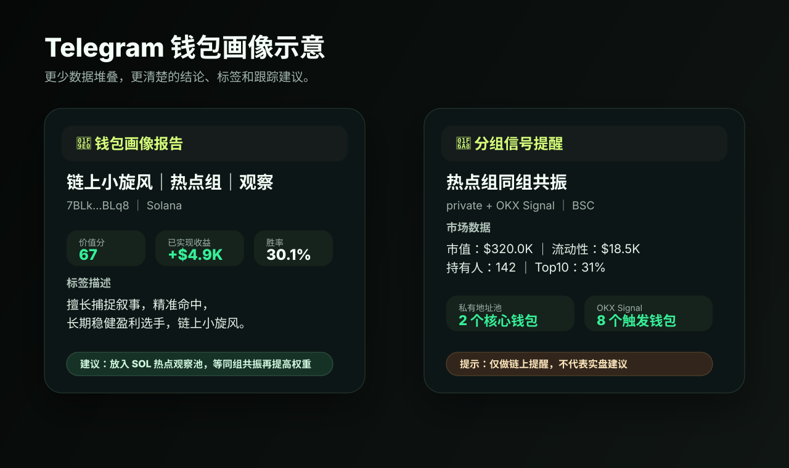

# Money Money Come

> 多链聪明钱画像与分组信号引擎。把你收藏的聪明钱地址，整理成可评分、可分组、可监控、可推送的个人链上研究系统。

`Money Money Come` 是一个面向 meme 扫链用户、链上研究员和 Agent 工作流的公开 Skill。它基于 **OnchainOS / OKX 链上数据能力**，支持 BSC 与 Solana 聪明钱地址画像、质量分层、分组管理、观察池导出、OKX Signal 辅助确认和 Telegram 信号提醒。

它默认只做 **分析、整理、提醒和模拟观察**，不会自动交易，不托管私钥，不承诺收益。



## 它解决什么问题

很多扫链用户并不是没有地址，而是地址越来越多，真正能用的越来越少。

- 收藏夹很大，但不知道哪些地址还值得盯
- 地址备注靠记忆，过几天就忘了为什么收藏
- 休眠地址、亏损地址、噪音地址混在一起
- 单个钱包买入容易误报，同类钱包共振才更值得看
- BSC 和 Solana 地址分开维护，整理成本高
- Telegram 如果只推成交流水，很快就会变成噪音

`Money Money Come` 的核心思路是：**先判断地址质量，再生成分组，再用可配置规则决定是否推送信号。**

## 产品工作流

```text
导入聪明钱地址
  -> 读取 OnchainOS / OKX 链上数据
  -> 生成单地址画像
  -> 计算钱包价值分
  -> 自动分组与筛选
  -> 生成 safeSignalPool
  -> 按你的规则监控同组集中买入
  -> 结合 OKX 官方 Signal 做辅助确认
  -> 推送 Telegram 可读信号卡
```

一句话理解：它不是帮你“看到更多买入”，而是帮你“少看无效买入”。

## 核心功能

### 1. 导入聪明钱地址

你可以导入自己收集的钱包列表，每个地址可以附带名称和 emoji：

```json
[
  {
    "address": "0x...",
    "name": "早期买入观察",
    "emoji": ""
  }
]
```

BSC：

```bash
npm run import-wallets -- examples/smart_wallets_input.example.json
```

Solana：

```bash
npm run sol:import-wallets -- examples/solana_wallets_input.example.json
```

仓库里的示例文件只用于展示输入格式，不是精选地址池。

### 2. 单地址画像

输入一个 BSC 或 Solana 钱包地址，Skill 会生成一份简洁画像：

- 已实现收益
- 胜率
- 最近活跃时间
- 交易节奏
- 低市值 meme 偏好
- 代表盈利
- 地址风格标签
- 是否适合进入核心观察池

示例风格：

```text
链上小旋风｜热点组｜观察
擅长捕捉叙事，低市值偏好强，代表盈利亮眼；但胜率还不算稳，适合放进 SOL 热点观察池，等同组共振再提高权重。
```

命令：

```bash
npm run wallet-report -- 0x...
npm run sol:wallet-report -- <solana-wallet-address>
```

### 3. 批量画像与价值评分

批量导入后，Skill 会为地址生成 `walletValueScore`，满分 100。它不是只看收益，而是综合评估这个地址是否值得长期跟踪。

| 维度 | 看什么 | 作用 |
| --- | --- | --- |
| 盈利能力 | 已实现 PnL、平均盈利、代表盈利 | 判断是否真的赚到钱 |
| 稳定性 | 胜率、盈利 token 数、亏损分布 | 防止一次暴赚掩盖长期乱冲 |
| 活跃度 | 最近交易时间、近期活跃天数 | 剔除长期休眠地址 |
| Meme 适配度 | 低市值买入占比、入场市值中位数 | 判断是否适合 meme 扫链 |
| 样本质量 | 交易数、参与 token 数 | 避免样本太薄就高估 |
| 可跟随性 | 平均买入金额、交易节奏 | 过滤过大资金或高频噪音 |

输出层级：

| 层级 | 含义 |
| --- | --- |
| 核心 | 分数高、近期活跃、收益为正、样本较足，可进入正式信号池 |
| 观察 | 有亮点，但还需要更多样本或同组确认 |
| 降权 | 有一定价值，但稳定性不足或噪音偏高 |
| 剔除 | 休眠、亏损明显、样本太薄或不适合作为信号来源 |

命令：

```bash
OKX_PROFILE_TIME_FRAME_DAYS=3 npm run profiles
OKX_PROFILE_TIME_FRAME_DAYS=3 npm run sol:profiles
```

### 4. 自动分组与安全观察池

Skill 会把地址归入不同风格组，让你知道这个地址为什么值得看：

| 分组 | 典型特征 | 默认用途 |
| --- | --- | --- |
| 热点组 | 擅长捕捉热点轮动，叙事敏感 | 观察热点共振 |
| 百倍组 | 偏早期、偏低市值，弹性更高 | 观察早期机会 |
| 盈利组 | 历史收益更稳 | 核心确认来源 |
| 加仓组 | 同一标的反复加仓 | 观察信仰型行为 |
| 观察组 | 有亮点但还不稳定 | 暂不作为强信号 |
| 噪音组 / 休眠组 | 高频乱冲、长期不活跃 | 默认排除 |

重点看三个池子：

- `signalPool`：正向地址池
- `safeSignalPool`：更严格的核心安全观察池
- `excludedSignalPool`：被降权或排除的地址

命令：

```bash
npm run wallet-groups
npm run export-curated
```

### 5. 分组集中买入信号

正式提醒不是“某个地址买了”，而是“你认可的一组地址在同一个时间窗口里集中买入同一个 token”。

默认逻辑：

- 同一正向分组内 `2` 个核心钱包，在 `10` 分钟内买入同一 token，触发正式信号
- 同一正向分组内 `3` 个核心钱包，标记为强信号
- 多个分组同时达标，标记为多组强信号
- 不同组各 1 个地址买入，只作为观察，不默认推送正式信号

你可以把这个规则改成自己的版本，例如：

- 热点组：2 个钱包 / 10 分钟内买入就提醒
- 盈利组：3 个钱包 / 20 分钟内买入才提醒
- 百倍组：2 个钱包 / 5 分钟内买入，并且市值低于 30 万才提醒
- OKX 官方 Signal：至少 8 个触发钱包，市值低于 50 万才提醒

## 自定义配置：你决定什么叫信号

复制规则模板：

```bash
cp config/signal-rules.example.json config/signal-rules.json
```

核心配置在 `private`：

```json
{
  "private": {
    "minWallets": 2,
    "strongMinWallets": 3,
    "windowMs": 600000,
    "sameGroupRequired": true,
    "crossGroupObserve": true
  }
}
```

这段配置的意思是：

- `minWallets=2`：同一组内至少 2 个核心钱包买入，才触发正式提醒
- `strongMinWallets=3`：同一组内 3 个核心钱包买入，标记为强信号
- `windowMs=600000`：统计窗口是 10 分钟
- `sameGroupRequired=true`：必须是同一正向分组内的钱包集中买入
- `crossGroupObserve=true`：不同组同时出现买入时，记录为跨组观察

如果你想更保守：

```json
{
  "private": {
    "minWallets": 3,
    "strongMinWallets": 4,
    "windowMs": 1200000,
    "sameGroupRequired": true
  }
}
```

含义：同一组内 3 个钱包在 20 分钟内买入同一 token，才推送给你。

如果你想更敏感：

```json
{
  "private": {
    "minWallets": 2,
    "strongMinWallets": 3,
    "windowMs": 300000,
    "sameGroupRequired": true
  }
}
```

含义：同一组内 2 个钱包在 5 分钟内买入同一 token，就推送给你。

你也可以用环境变量覆盖：

```bash
MIN_PRIVATE_WALLETS=2
STRONG_PRIVATE_WALLETS=3
PRIVATE_WINDOW_MS=600000
PRIVATE_SAME_GROUP_REQUIRED=1
```

## OKX 官方 Signal 辅助提醒

OnchainOS / OKX 提供 Smart Money / KOL / Whale 的聚合 Signal 数据，Skill 可以把它作为第二条信号通道。

需要说明：`6 个触发钱包 / 50 万市值` 不是 OKX 官方强制标准，而是本 Skill 默认的降噪策略。OKX 提供信号数据和过滤参数，实际提醒阈值由你决定。

默认配置：

```json
{
  "okxOfficial": {
    "enabled": true,
    "soloAlert": true,
    "walletTypes": "1,3",
    "limit": 30,
    "minTriggerWallets": 6,
    "maxMarketCapUsd": 500000,
    "minCompositeScore": 3
  }
}
```

你可以继续加过滤项：

```json
{
  "okxOfficial": {
    "minTriggerWallets": 8,
    "minAmountUsd": 1000,
    "maxMarketCapUsd": 300000,
    "minLiquidityUsd": 5000,
    "maxSoldRatioPercent": 40
  }
}
```

含义：只有 OKX Signal 中至少 8 个钱包触发、交易额过线、市值和流动性符合要求、触发钱包没有明显大量卖出时，才推送。

官方文档入口：

- [OnchainOS 是什么](https://web3.okx.com/zh-hans/onchainos/dev-docs/home/what-is-onchainos)
- `onchainos signal list --help` 可查看当前 CLI 支持的 Signal 过滤参数

## Telegram 提醒效果



信号卡会尽量少堆数据，把核心判断讲清楚：

```text
🚨 BSC 分组信号

🪙 TOKEN ｜ Token Name
📌 等级：强信号 ｜ 热点组 ｜ 情绪分 5.8
🔗 合约：0x...
📡 来源：private + okx

📊 市场数据
• 市值：$320.0K
• 流动性：$18.5K
• 持有人：142

🧠 聪明钱触发
• 触发地址：2 个
• 触发模式：热点组同组共振
• OKX Signal：官方聚合触发钱包 8 个，阈值 6 个

⚠️ 默认仅分析和提醒，不代表实盘建议。
```

## 安装

```bash
npx skills add https://github.com/qiuqiubuchongle-cloud/money-money-come
```

安装后重启 Codex / Agent，让 Skill 生效。

## 快速开始

BSC：

```bash
npm run import-wallets -- examples/smart_wallets_input.example.json
OKX_PROFILE_TIME_FRAME_DAYS=3 npm run profiles
npm run wallet-groups
npm run export-curated
npm run wallet-report -- 0x...
```

Solana：

```bash
npm run sol:import-wallets -- examples/solana_wallets_input.example.json
OKX_PROFILE_TIME_FRAME_DAYS=3 npm run sol:profiles
npm run sol:wallet-groups
npm run sol:export-curated
npm run sol:wallet-report -- <solana-wallet-address>
```

服务器监控：

```bash
cp config/signal-rules.example.json config/signal-rules.json
cp deploy/server.env.example deploy/server.env
./deploy/run-server-monitor.sh
```

详细部署见 [`deploy/README-server.md`](./deploy/README-server.md)。

## Agentic Wallet 与数据源边界

- Agentic Wallet 更适合做登录、签名、转账、合约调用等执行层能力
- 本 Skill 的画像、交易、行情、Signal 数据主要来自 OnchainOS / OKX market、tracker、portfolio、signal 接口
- 未来如果接入自动买卖，必须单独增加交易前风控、仓位、滑点、止盈止损和二次确认

## 安全边界

- 不保存私钥
- 不自动买卖
- 不承诺收益
- 示例地址只用于格式演示，不是精选地址池
- Telegram token、OKX key、服务器 `.env` 不会进入公开仓库
- 可选外部增强源不是跑通主流程的必要依赖

## 适合谁

- 已经积累大量聪明钱地址，但缺少整理方法的人
- 想把 BSC / Solana 地址统一做画像的人
- 想自己定义“几个钱包、多久时间、什么组别”才推送的人
- 想减少 Telegram 噪音，只看更高质量共振提醒的人
- 想用 Agent 搭建个人链上研究工作流的人

## 风险提示

本 Skill 仅用于链上分析、信号整理与提醒，不构成投资建议。

任何实盘动作都建议额外复核：

- 合约风险
- 流动性
- 持有人集中度
- Dev / insider / bundler 风险
- 代币叙事真实性
- 仓位管理和止盈止损
