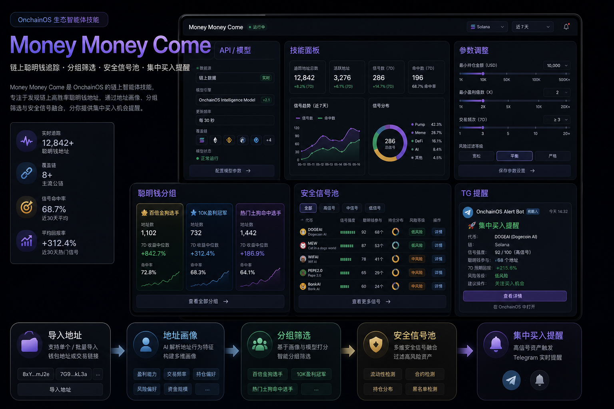

# Money Money Come

> 让一堆零散的聪明钱地址，变成一个会自己筛选、分组、提醒的个性化买入雷达。

`money-money-come` 是一个基于 **OnchainOS + OKX 官方链上画像能力** 构建的聪明钱分析 Skill。  
它不是只会转发地址动向的提醒器，而是一个会先做画像、先筛噪音、再输出分组化信号的 Agent 工作流。



## 你会得到什么

- **地址画像**：给任意聪明钱地址生成简洁质量报告，快速判断值不值得跟
- **地址分组**：按收益、活跃度、交易习惯、meme 偏好做分类，不再靠手动备注记忆
- **集中提醒**：当同组多个高质量地址集中买入同一 meme 时，推送更可读的 Telegram 信号

## 一句话理解它的价值

你给它一堆钱包地址，  
它帮你把“收藏夹”整理成“信号系统”。

## 安装

```bash
npx skills add https://github.com/qiuqiubuchongle-cloud/money-money-come
```

安装后重启 Codex / Agent，让新 Skill 生效。

## 它在做什么

基于 OnchainOS 与 OKX 官方接口能力，`money-money-come` 主要完成三步：

1. 识别地址：分析单个聪明钱地址的收益、活跃度、交易节奏、偏好市值段与行为特征  
2. 筛选地址：剔除长期休眠、低胜率、高亏损、噪音过大的钱包，保留更稳定的观察池  
3. 生成信号：当同一正向分组中的多个高质量地址集中买入同一 meme 时，推送 Telegram 提醒  

## 它适合谁

- 手里已经收藏了一批聪明钱地址，但越来越难管理的人
- 想把“地址收藏夹”升级成“结构化信号池”的扫链用户
- 想让 Agent 帮自己做地址画像、分组、排序、提醒的人
- 希望基于 OKX 官方链上数据做更稳妥分析，而不是只看零散截图和主观备注的人

## 核心能力

### 1. 地址质量报告

当你给出某个地址时，Skill 会尽量基于 OKX 官方链上画像数据输出一份简洁报告，重点包括：

- 近期开仓与交易频率
- 已实现 PnL
- 胜率与稳定性
- 是否偏好小市值 meme
- 是否属于安全信号池
- 建议继续监控、降权观察还是剔除

### 2. 聪明钱分组系统

Skill 会根据地址画像把钱包归类到不同风格组，例如：

- `10K盈利冠军`
- `百倍金狗选手`
- `热门土狗命中选手`
- `信仰加仓选手`
- `均衡侦察兵`
- `高频交易菜鸡`
- `休眠地址`

这一步的目标不是“给地址起外号”，而是让后续信号提醒具备结构化语义。

### 3. 安全信号池

不是所有活跃地址都值得跟。

`money-money-come` 会在原始分组基础上再做一层安全筛选，默认排除：

- 高频但低质量的钱包
- 已实现亏损很大且胜率偏低的钱包
- 长期不活跃的钱包
- 只会制造噪音、缺乏稳定性的热点追逐地址

最终只让更稳的地址进入 `safeSignalPool`，减少提醒污染。

### 4. 集中买入提醒

真正的重点在这里。

当同一正向分组内，多个高质量地址在时间窗口内集中买入同一 meme 代币时，Skill 会整理出一条更像“可读结论”的信号，而不是一堆原始成交明细。

提醒内容可包含：

- 分组名称
- 触发钱包数量
- 钱包列表
- 代币名称与合约地址
- 置信度 / 情绪倾向
- 风险提示

## 安全默认值

为了避免 Agent 过度激进，这个 Skill 默认遵守以下规则：

- 默认只做分析、排序、分组、提醒
- 默认不执行自动交易
- 默认优先使用 `safeSignalPool`
- 默认要求同组多地址共振，才升级为重点信号

也就是说，它默认是一个“研究与提醒层”，不是一个会擅自开仓的黑盒机器人。

## 配置

复制 `.env.example` 为 `.env`，填写以下配置：

```bash
OKX_API_KEY=...
OKX_SECRET_KEY=...
OKX_PASSPHRASE=...
TELEGRAM_BOT_TOKEN=...
TELEGRAM_CHAT_ID=...
```

然后登录 OnchainOS：

```bash
onchainos wallet login
```

你也可以先检查状态：

```bash
onchainos wallet status
onchainos market portfolio-supported-chains
```

默认建议保留：

```bash
OKX_PROFILE_TIME_FRAME_DAYS=3
GMGN_ENABLED=0
BINANCE_MEME_RUSH_ENABLED=0
BINANCE_TOKEN_INFO_ENABLED=0
```

也就是说，这个 Skill 的主流程默认只依赖 **OnchainOS + OKX 官方画像接口 + 你的地址列表**。  
GMGN 和 Binance 在当前版本里属于可选增强层，不是跑通主流程的必需项。

## 典型工作流

### 1. 导入聪明钱地址

```bash
npm run import-wallets -- examples/gmgn_wallets_input.example.json
```

注意：仓库里的示例地址文件只是**输入格式示例**，不是筛选过的高质量聪明钱样本。  
如果你直接拿示例地址跑，出现 `safeSignalPool = 0`、被分到“排除组 / 休眠组”都很正常，这不代表 Skill 无效，只代表你还没有导入真实地址池。

### 2. 构建地址画像

```bash
npm run profiles
```

输出：

- `data/smart_wallet_profiles_bsc.json`

### 3. 生成分组与信号池

```bash
npm run wallet-groups
```

输出：

- `data/smart_wallet_groups_bsc.json`

重点看：

- `signalPool`
- `safeSignalPool`
- `excludedSignalPool`

### 4. 导出精品地址

```bash
npm run export-curated
```

输出：

- `data/curated_smart_wallets_bsc.json`
- `data/curated_smart_wallets_bsc.txt`

### 5. 分析单个地址

```bash
npm run wallet-report -- 0x...
```

### 6. 开启分组监控

```bash
npm run monitor
```

监控模式的默认定位是：

- 读取你已经生成好的画像与分组文件
- 基于 `safeSignalPool` 做分组集中买入提醒
- 默认不要求 GMGN / Binance 一起参与

如果后续你想把 GMGN / Binance 当成辅助确认源，再显式打开它们即可。

## 输入格式

支持 GMGN 风格的地址列表：

```json
[
  {
    "address": "0x...",
    "name": "optional",
    "emoji": ""
  }
]
```

## 这个 Skill 最有价值的地方

它不是帮你“多看几个地址”。

它真正有价值的地方在于：

- 帮你给一堆地址做结构化记忆
- 帮你从杂乱收藏夹里筛出值得盯的地址
- 帮你把原始链上动作压缩成分组化的情绪信号

换句话说，它想做的是：

**把聪明钱地址列表，变成一个可以持续迭代的个性化买入雷达。**

## 风险提示

本 Skill 仅用于链上分析、信号整理与提醒，不构成投资建议。

任何后续实盘动作，都建议额外复核：

- 流动性
- 合约风险
- 持仓集中度
- 代币叙事真实性
- 仓位管理与止盈止损
