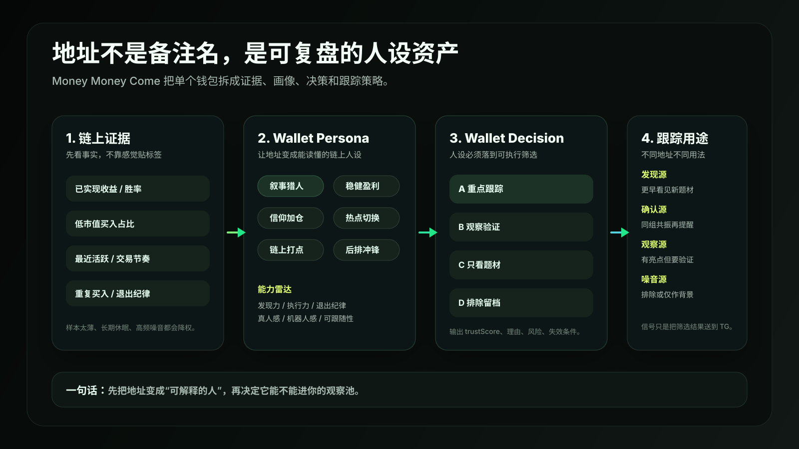

# Money Money Come

> 多链聪明钱地址画像与筛选系统。不是再做一个信号搬运工，而是帮你把一堆钱包地址变成可解释、可评分、可分层、可复盘的个人链上研究库。

`Money Money Come` 基于 **OKX OnchainOS** 构建，产品重心已经明确转向：**地址分析、筛选、人设判断**。

信号通知只是辅助输出。真正重要的是：

- 这个地址到底像什么类型的链上玩家？
- 它是真的有发现能力，还是只是高频噪音？
- 它适合作为发现源、确认源，还是只适合留档？
- 它什么时候该进核心池，什么时候该降权，什么时候该排除？

如果一个 Skill 只能告诉你“某个钱包买了”，那价值很有限。`Money Money Come` 想做的是先把地址看懂，再决定要不要让它影响你的判断。


## 为什么做这个

很多扫链用户不是没有地址，而是地址越来越多，真正能用的越来越少。

你可能收藏了很多“聪明钱”：群友给的、榜单看到的、某次暴赚留下来的、自己盯盘记下来的。问题是过几天之后，这些地址就会变成一堆冷冰冰的 `0x...`。

你很难马上想起来：

- 它当初为什么被收藏？
- 它是早期发现型，还是后排追涨型？
- 它历史上到底赚过钱，还是只中了一次？
- 它最近还活跃吗？
- 它适合单独观察，还是必须等同组共振？
- 它是人类交易风格，还是更像脚本流水？

所以这个 Skill 的核心不是“推更多信号”，而是把地址先整理成一套可复盘的判断系统。

## 产品定位

`Money Money Come` 更像你的个人链上地址研究助理。

它不负责替你喊单，也不负责自动交易。它负责把你给它的钱包地址拆开分析，告诉你：这个地址值不值得继续看、应该怎么用、风险在哪里。

| 原始信号工具 | Money Money Come |
| --- | --- |
| 看到谁买了什么 | 判断这个地址值不值得信 |
| 信息很多，噪音也很多 | 先筛地址，再看信号 |
| 快速提醒 | 长期地址库建设 |
| 单次信号驱动 | 人设、分层、跟踪策略驱动 |
| 容易变成 TG 流水 | 只把筛过的结果推给你 |

一句话：**先判断地址，再判断信号。**

## 核心流程

```text
导入聪明钱地址
  -> 读取 OKX OnchainOS 链上数据
  -> 提取收益、胜率、活跃度、入场市值、交易节奏
  -> 生成 Wallet Persona 钱包人设
  -> 生成 Wallet Decision 跟踪决策
  -> 分成核心池、观察池、降权池、排除池
  -> 只有筛过的地址才参与后续信号提醒
```



## 核心功能一：地址画像

输入一个钱包地址，Skill 会生成一份结构化画像。

它不会只给你贴一个好听标签，而是会把标签背后的链上证据列出来：

- 已实现收益
- 胜率
- 最近活跃时间
- 交易样本数量
- 覆盖 token 数量
- 低市值买入占比
- 入场市值中位数
- 重复买入行为
- 高频交易风险
- 代表盈利

命令：

```bash
npm run wallet-report -- 0x...
npm run sol:wallet-report -- <solana-wallet-address>
```

输出风格类似：

```text
早期叙事猎人｜早期发现型聪明钱｜核心观察池｜重点跟踪
叙事敏感、低市值偏好、出手靠前；可同时作为发现源和确认源。
同人设/同组 2 个钱包 5 分钟内买入可提醒，3 个钱包升强提醒。
```

## 核心功能二：Wallet Persona 人设判断

我希望这个 Skill 最有价值的地方，是把地址变成“能读懂的人”。

现在支持的人设包括：

| 人设 | 含义 | 用法 |
| --- | --- | --- |
| 早期叙事猎人 | 偏早期、低市值、题材敏感 | 适合作为发现源 |
| 稳健盈利派 | 收益和胜率更稳定 | 适合作为确认源 |
| 信仰加仓派 | 会对同一标的反复买入 | 看持续加仓，也要看退出 |
| 热点切换手 | 高频切换题材，嗅觉快 | 适合观察热点，不适合盲跟 |
| 链上打点机 | 节奏机械、交易密集 | 多数情况下识别为噪音 |
| 后排冲锋号 | 胜率偏低，容易追高 | 默认降权或排除 |
| 沉睡旧钱包 | 长期不活跃 | 只留档，不触发 |
| 均衡观察员 | 信息还不够极端 | 继续收集样本 |

强标签不会乱写。比如“项目方”“内幕”“机器人”这类判断，除非证据明确，否则只会写成“疑似”或“候选”。

## 核心功能三：Wallet Decision 跟踪决策

人设只是第一步，最终要落到怎么用。

`Wallet Decision` 会给每个地址一个 A/B/C/D 判断：

| 等级 | 结论 | 处理方式 |
| --- | --- | --- |
| A | 重点跟踪 | 进入核心观察池，可作为发现源或确认源 |
| B | 观察验证 | 进入观察池，需要同组或外部确认 |
| C | 只看题材 | 不单独触发，只做背景参考 |
| D | 排除留档 | 不参与信号，减少噪音 |

同时会输出：

- `trustScore`：地址信任分
- `watchMode`：发现源 / 确认源 / 加仓观察 / 背景参考 / 排除留档
- `reasons`：为什么给这个判断
- `risks`：当前最大风险
- `triggerRule`：这个地址参与提醒时应该怎么触发
- `invalidators`：什么情况说明它该降权或移出

这部分很关键。因为不是每个“聪明钱”都应该同等对待：

- 早期叙事猎人可以帮你发现题材，但容易误伤
- 稳健盈利派不一定最早，但适合做确认
- 信仰加仓派要看它有没有退出能力
- 热点切换手可以看热度，但不能单点盲跟
- 链上打点机大概率只适合用来识别噪音

## 核心功能四：批量筛选与分层

批量导入后，Skill 会给每个地址计算 `walletValueScore`，并生成分层结果。

评分不是只看收益，而是综合：

| 维度 | 看什么 |
| --- | --- |
| 盈利能力 | 已实现 PnL、平均盈利、代表盈利 |
| 稳定性 | 胜率、盈利 token 数、亏损分布 |
| 活跃度 | 最近交易时间、近期活跃天数 |
| Meme 适配 | 低市值买入占比、入场市值中位数 |
| 样本质量 | 交易数、参与 token 数 |
| 可跟随性 | 平均买入金额、交易节奏 |

最终会分成：

| 池子 | 含义 |
| --- | --- |
| 核心池 | 质量高、近期活跃、可以重点跟踪 |
| 观察池 | 有亮点，但还需要更多样本验证 |
| 降权池 | 有信息价值，但不适合作为主判断 |
| 排除池 | 休眠、亏损、高频噪音或样本太薄 |

命令：

```bash
OKX_PROFILE_TIME_FRAME_DAYS=3 npm run profiles
npm run wallet-groups
npm run export-curated
```

Solana：

```bash
OKX_PROFILE_TIME_FRAME_DAYS=3 npm run sol:profiles
npm run sol:wallet-groups
npm run sol:export-curated
```

## 地址导入

你可以导入自己收集的钱包列表，每个地址可以附带名称和 emoji。

```json
[
  {
    "address": "0x...",
    "name": "早期买入观察",
    "emoji": ""
  }
]
```

BSC：

```bash
npm run import-wallets -- examples/smart_wallets_input.example.json
```

Solana：

```bash
npm run sol:import-wallets -- examples/solana_wallets_input.example.json
```

仓库里的示例文件只展示格式，不是精选地址池。

## 信号通知只是辅助

信号模块还在，但它的定位要摆正：

它不是产品核心，只是把筛过的地址池结果推到你面前。

正式提醒不是“某个地址买了”，而是“你认可的一组地址，在同一个时间窗口里，集中买入同一个 token”。

默认逻辑：

- 同一正向分组内 `3` 个核心钱包，在 `2` 分钟内买入同一 token，触发正式信号
- 同一正向分组内 `3` 个核心钱包，标记为强信号
- 同一正向分组内 `2` 个核心/观察钱包，在 `5` 分钟内买入同一 token，触发观察信号
- 多个分组同时达标，标记为多组强信号
- 观察信号只提醒，不进入模拟盘

它真正看的不是“买没买”，而是：

- 买入的钱包是不是你已经筛过的高质量地址
- 这些钱包是不是同组、同类、同时间窗口共振
- token 当前是早期起量，还是已经过热
- 流动性、持有人、风险分是否还能看

## 自定义配置

你可以自己规定：几个钱包、多久时间、是否必须同组，才提醒。

复制配置：

```bash
cp config/signal-rules.example.json config/signal-rules.json
```

示例：

```json
{
  "private": {
    "minWallets": 3,
    "strongMinWallets": 3,
    "windowMs": 120000,
    "sameGroupRequired": true,
    "observe": {
      "enabled": true,
      "minWallets": 2,
      "windowMs": 300000,
      "sameGroupRequired": true
    }
  }
}
```

含义：

- 正式信号：同组 3 个核心钱包，2 分钟内买入同一 token
- 观察信号：同组 2 个钱包，5 分钟内买入同一 token
- 不同组各 1 个钱包买入，只作为观察，不作为强提醒

环境变量也可以覆盖：

```bash
MIN_PRIVATE_WALLETS=3
STRONG_PRIVATE_WALLETS=3
PRIVATE_WINDOW_MS=120000
PRIVATE_SAME_GROUP_REQUIRED=1
```

## ETH Meme 雷达

ETH 雷达是辅助模块，适合看 ETH 链上的 meme 热度。

它可以合并：

| 来源 | 作用 |
| --- | --- |
| OKX Signal | 看外部聪明钱 / KOL / Whale 聚合动向 |
| Hot Tokens / price-info | 看成交量和热度是否突然放大 |
| 私有 ETH 地址池 | 看你自己的观察地址是否首买共振 |
| ETH Gas Radar | gas 升高时，看最近区块里大家在抢什么 token |

雷达不会把所有 raw signal 都推给你，会先做：

- `setup / confirm / late / avoid` 分级
- 生命周期判断：早期、确认、过热、后排、流动性薄
- 风险分：流动性、持有人、Top10 集中、卖出比例
- 钱包集群：观察地址两两同买关系

运行：

```bash
npm run monitor:eth-meme
npm run review:eth-signals
npm run brief:daily
```

如果配置 `ETH_RPC_URL`，Gas Radar 才能真正监测“主网 gas 变贵时大家正在抢什么”。

## Telegram 输出

Telegram 卡片要尽量克制，只保留真正有用的信息。

地址画像卡会突出：

- 人设名称
- 地址身份
- A/B/C/D 判断
- 信任分
- 跟踪用途
- 核心数据
- 代表盈利
- 跟踪建议

信号卡只作为辅助：

```text
🚨 ETH Meme 雷达

🪙 名称：TOKEN ｜ Token Name
🔗 合约：0x...
📌 判断：确认 ｜ 早期起量
📊 市值：$320.0K
🧠 聪明钱买入金额：$12.3K
💵 价格：0.00000123
👥 持有人：142
📝 备注：私有地址池与 OKX Signal 同时出现，优先复核。

⚠️ 仅供观察，不构成买入建议。
```


## Daily Alpha Brief

日报不是为了假装有胜率，而是把当天信号结构说清楚。

它会总结：

- 今日 ETH Gas 异动买入 Top Token
- 私有地址池共振 Token
- OKX Signal 与 Hot Token 重叠 Token
- 昨日信号结构表现
- 最近可能失效的规则

运行：

```bash
npm run brief:daily
ALPHA_BRIEF_SEND_TG=1 npm run brief:daily
```

如果还没有接入 15m / 1h / 6h 后验价格回放，它不会假装统计命中率，只会提示样本不足。

## 安装

```bash
npx skills add https://github.com/qiuqiubuchongle-cloud/money-money-come
```

安装后重启 Codex / Agent，让 Skill 生效。

## 快速开始

BSC：

```bash
npm run import-wallets -- examples/smart_wallets_input.example.json
OKX_PROFILE_TIME_FRAME_DAYS=3 npm run profiles
npm run wallet-groups
npm run export-curated
npm run wallet-report -- 0x...
```

Solana：

```bash
npm run sol:import-wallets -- examples/solana_wallets_input.example.json
OKX_PROFILE_TIME_FRAME_DAYS=3 npm run sol:profiles
npm run sol:wallet-groups
npm run sol:export-curated
npm run sol:wallet-report -- <solana-wallet-address>
```

服务器监控：

```bash
cp config/signal-rules.example.json config/signal-rules.json
cp deploy/server.env.example deploy/server.env
./deploy/run-server-monitor.sh
```

详细部署见 [`deploy/README-server.md`](./deploy/README-server.md)。

## Agentic Wallet 与数据源边界

- Agentic Wallet 更适合做登录、签名、转账、合约调用等执行层能力
- 本 Skill 的画像、交易、行情、Signal 数据主要来自 OnchainOS / OKX market、tracker、portfolio、signal 接口
- 未来如果接入自动买卖，必须单独增加交易前风控、仓位、滑点、止盈止损和二次确认

## 安全边界

- 不保存私钥
- 不自动买卖
- 不承诺收益
- 示例地址只用于格式演示，不是精选地址池
- Telegram token、OKX key、服务器 `.env` 不会进入公开仓库
- 信号通知只是辅助，不是买入建议

## 适合谁

- 已经积累大量聪明钱地址，但缺少整理方法的人
- 想把 BSC / Solana 地址统一做画像的人
- 想给钱包建立人设、评分、分层和复盘记录的人
- 想自己定义“几个钱包、多久时间、什么组别”才提醒的人
- 想减少 Telegram 噪音，只看更高质量共振的人
- 想用 Agent 搭建个人链上研究工作流的人

## 风险提示

本 Skill 仅用于链上分析、信号整理与提醒，不构成投资建议。

任何实盘动作都建议额外复核：

- 合约风险
- 流动性
- 持有人集中度
- Dev / insider / bundler 风险
- 代币叙事真实性
- 仓位管理和止盈止损
